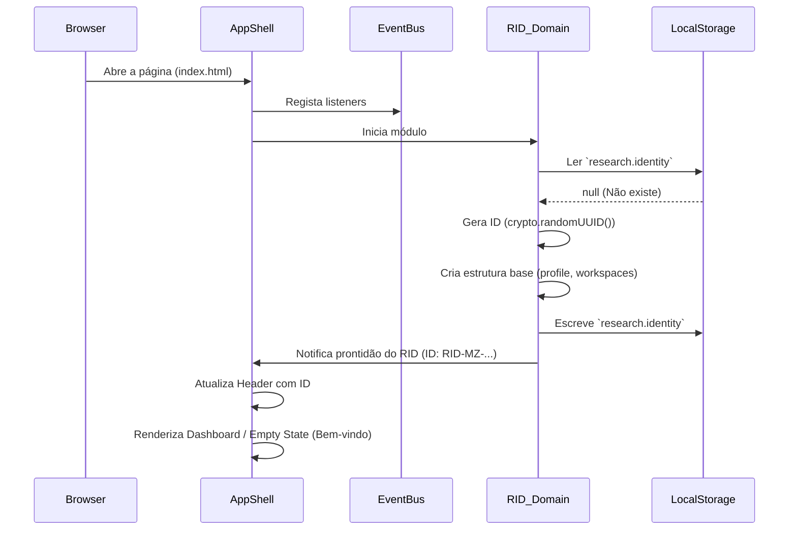
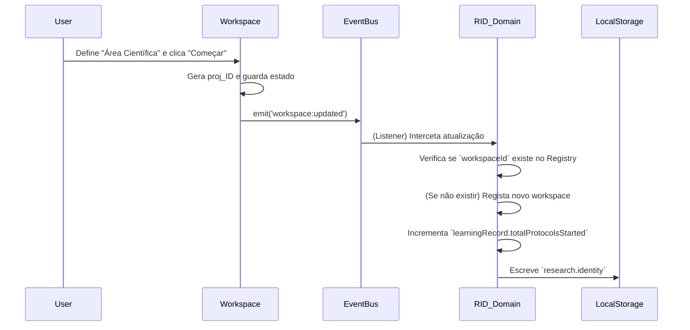
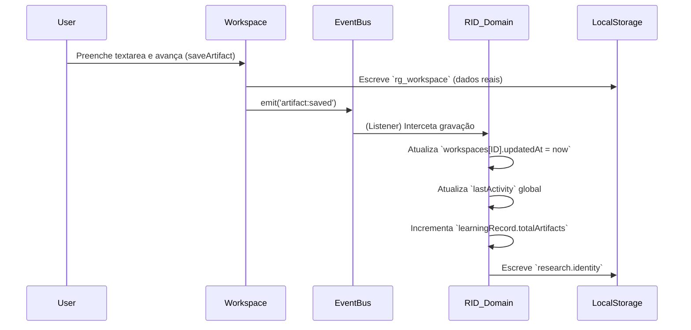
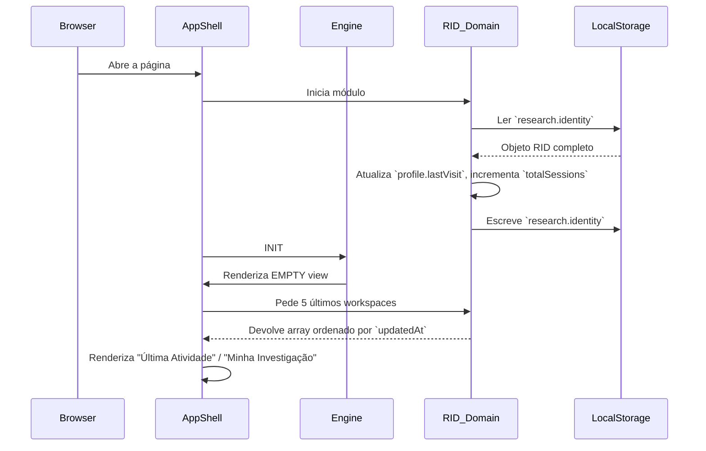

# Research Identity (RID) Sequence Diagram

Este documento mapeia os fluxos essenciais de como o domínio RID escuta, interage e se atualiza de forma não-intrusiva face à aplicação.

## 1. Primeira Abertura da Aplicação (Geração do RID)

## 2. Início de uma Nova Investigação (Workspace)

## 3. Gravação de um Artefacto Científico (Atividade)

## 4. Reabertura e Retoma (Abertura com Histórico)

